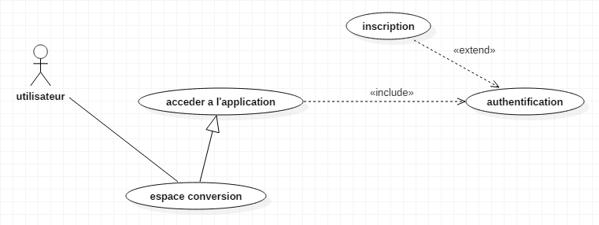
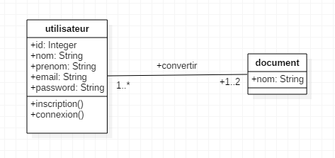

*** Detail sur l'application ***
     *******************

<h2>nom et prenom des binomes</h2>

Assim Mahamat Abderahim Malick

Younouss Haroun Moursal

<h2>Architecture globale de l'application</h2>

L'application sera conçue sous la forme d'un ensemble de web service ou l'on trouvera le web service client qui demande des services 
et le web service fournisseur ou serveur qui resoudra les services demandés.

<h2>Architecture de la couche de donnée</h2>

notre application contiendra une base de donnée sur lequelle seront enregistré les identifiants des utilisateurs et le chemins de documents convertie;
l'application contiendra egalement un dossier qui va contenir tout les documents convertie.
quand un utilisateur convertie un document on va pouvoir stockée le document dans ce dossier ensuite on lui propose de telecharger son document qu'il vient de convertir. 
Une solution pour gerer la couche de donnée c'est d'utiliser le pattern DAO 
justification : L'utilisation de DAO permet de s'abstraire de la façon dont les données sont stockées au niveau des objets métier. Ainsi, le changement du mode 
de stockage ne remet pas en cause le reste de l'application. En effet, seules ces classes dites "techniques" seront à modifier (et donc à re-tester). 
Cette souplesse implique cependant un coût additionnel, dû à une plus grande complexité de mise en œuvre.

<h2>Gestion des clients</h2>

Les clients seront gerer comme Thread
une fois q'un client arrive a la plateforme il doit s'authentifier grace a son PID on pourra gerer ce client parraport au autre. 
au cas ou il y'aura une activité en cours d'execution (conversion) alors le client sera mis en attente cette activité (la conversion) constituera 
notre Section critiqueet tout les clients seront gerées en fonction de l'etat de la section  critique qui sera libre ou occupé et les clients seront mis 
dans l'etat demandeur ou en attente ou en execution
Justification : le Thread represente des processus leger, l'utilisation de plusieurs threads permet de paralléliser le traitement
et de l'executer rapidement.

<h2>Technologie choisie pour le développement</h2>

langage java, plateforme (netbeans ou j2ee), github pour le dépot git, OpenShift pour le deploiement de l'application sur le cloud.

 

